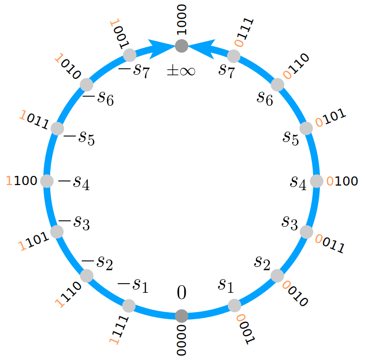

[](https://www.repostatus.org/#active)
[](https://travis-ci.com/milankl/Sonums.jl)
[](https://ci.appveyor.com/project/milankl/softsonum-jl)
[](https://cirrus-ci.com/github/milankl/Sonums.jl)

[](https://zenodo.org/badge/latestdoi/191624340)

# Sonums.jl
A software emulator for Sonums - the Self-Organizing NUMbers. A number format that learns from data. Sonum8 is the 8bit version, Sonum16 for 16bit computations. This number format shares many similarities with the [type II unums](http://johngustafson.net/pdfs/BeatingFloatingPoint.pdf) developed by [John Gustafson](http://johngustafson.net/).

# Usage
Load the emulator with `using Sonums`, then train the 8 or 16bit Sonums with your data (a maximum entropy approach is used)
```julia
data = randn(10_000_000)
trainSonum8(data)
trainSonum16(data)
```
Alternatively, you can also use a 127-element vector (8bit) or 32767-element vector (16bit) to set the representable Sonums directly. To imitate Posit8 for example you may do

```julia
using SoftPosit
posit8 = Float64.(Posit8.(UInt8.(collect(1:127))))  # creates a list of Posit8 numbers in (0,Inf)
setSonum8(posit8)
setUnderflow8(false)  # Posits don't underflow but Sonums do by default
```
Once either Sonum8 or Sonum16 is set up, you have to fill the lookup tables for all arithmetic operations
```julia
fillSonumTables8()    #  8bit: this is quick
fillSonumTables16()   # 16bit: this may take a few minutes
```
And now we can do things like
```julia
julia> a = Sonum16(1.2);
julia> b = Sonum16(0.5);
julia> a-b
Sonum16(0x420a)
julia> Float64(a-b)
0.7000189572298372
julia> Float64(sqrt(a))
1.0954481925887807
```

# Theory

The Sonum circle follows closely the idea of the [posit circle](http://johngustafson.net/pdfs/BeatingFloatingPoint.pdf) developed by [John Gustafson](http://johngustafson.net/). Instead of imposing a symmetry with respect to the multiplicative inverse, as proposed for the type II unums, Sonums only have a additive symmetry around 0. The 4bit Sonum circle is therefore



with values s₁ to s₇ to be defined. The bitpattern `0000` is reserved for 0, and `1000` for NaR (not a real). Negative numbers directly follow as the [two's complement](https://en.wikipedia.org/wiki/Two%27s_complement) for any s₁ to s₇.

# Benchmarking

Unfortunately the table lookup matrices require 5GB (1GB per table, 2GB for division) of RAM for 16bit (<1Mb for 8bit). However, arithmetic operations are reasonably fast. In order to avoid caching in the benchmarking, we perform operations over arrays

```julia
julia> using BenchmarkTools

julia> N = 100000;

julia> a = Sonum16.(randn(N));

julia> b = Sonum16.(randn(N));

julia> @btime +($a,$b);
  2.358 ms (2 allocations: 195.39 KiB)

julia> @btime -($a,$b);
  2.348 ms (2 allocations: 195.39 KiB)

julia> @btime .*($a,$b);
  1.829 ms (2 allocations: 195.39 KiB)

julia> @btime ./($a,$b);
  1.753 ms (2 allocations: 195.39 KiB)

julia> @btime sqrt.($a);
  433.788 μs (2 allocations: 195.39 KiB)
```
So that `+,-` require ca. 2.35ms/N = __23.5ns__, `*,/` ca 1.8ms/N = __18ns__ and `sqrt` ca. __4.3ns__

# Testing
Sonums are tested against the SoftPosit library: Once set up with Posits, Sonums yield bitwise-reproducible results for +,-,*,/. See [here](https://github.com/milankl/Sonums.jl/blob/51ceeec168508aa6b35937f89d714d9f2b2e78f6/test/runtests.jl#L46)

# Installation
In the package manager do
```julia
(v1.1) pkg> add https://www.github.com/milankl/Sonums.jl
```
